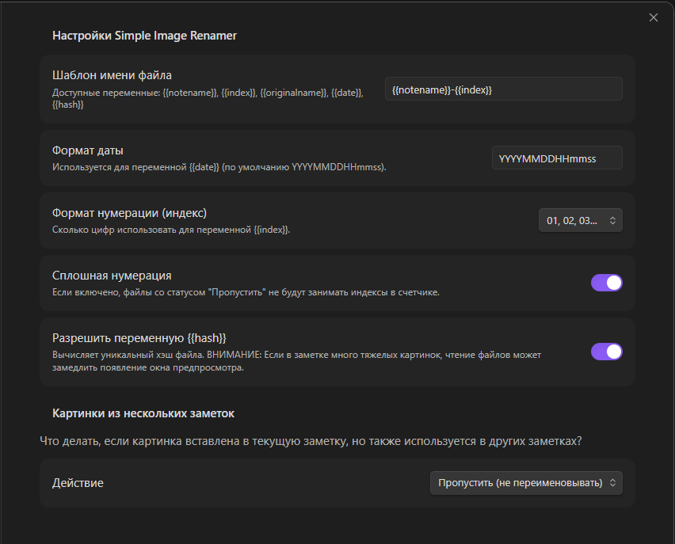
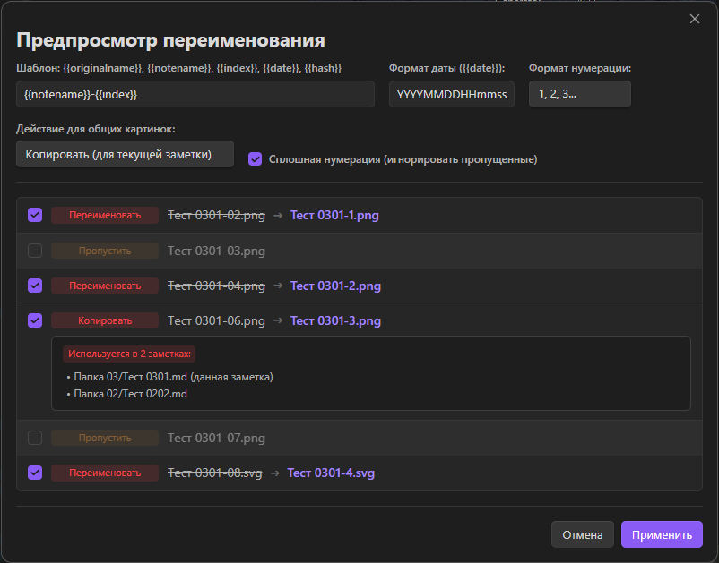

# LS Attachment Image Renamer

Плагин для [Obsidian](https://obsidian.md), позволяющий массово переименовывать изображения, вставленные в текущую заметку.

- **Глобальные настройки** - основные настройки плагина, которые используются по умолчанию для модального окна предпросмотра файлов перед переименованием.

- **Предпросмотр перед переименованием** — модальное окно показывает все найденные файлы, предлагаемые новые имена и позволяет выбрать, какие файлы переименовывать.

## Возможности

- **Переименование изображений в текущей заметке** — находит все картинки (png, jpg, jpeg, gif, webp, svg, bmp), которые вставлены или вложены в текущую заметку, и предлагает переименовать их по заданному шаблону.

- **Настраиваемый шаблон имени файла** — используйте переменные для гибкой настройки имён:
  - `{{notename}}` — имя текущей заметки;
  - `{{index}}` — порядковый номер (с настраиваемым форматом: 1, 01, 001, 0001);
  - `{{originalname}}` — оригинальное имя файла;
  - `{{date}}` — дата создания файла (настраиваемый формат);
  - `{{hash}}` — уникальный SHA-256 хэш файла (первые 8 символов).

- **Обработка общих изображений** — если изображение используется в нескольких заметках, плагин предлагает три варианта действий:
  - **Пропустить** — не переименовывать файл;
  - **Переименовать** — переименовать файл (ссылки обновятся во всех заметках);
  - **Копировать** — создать копию файла с новым именем только для текущей заметки.

- **Автоматическое обновление ссылок** — при переименовании Obsidian автоматически обновляет все ссылки на файлы (при включённой настройке "Всегда обновлять внутренние ссылки").

- **Сплошная нумерация** — опция, позволяющая игнорировать пропущенные файлы при подсчёте индексов.

## Установка

Данный плагин еще не добавлен в плагины Обсидиан, поэтому для установки выбирайте описанные ниже варианты установки.

### Через плагин BRAT (рекомендуется)

1. Установите и включите плагин [BRAT](https://github.com/TfTHacker/obsidian42-brat) из каталога сообществ плагинов
2. Откройте **Settings → BRAT**
3. Нажмите **Add Beta plugin** и введите URL репозитория: `https://github.com/LoocSiL/obsidian-ls-attachment-image-renamer`
4. Нажмите **Add Plugin**
5. Перезагрузите Obsidian
6. Включите плагин в **Settings → Community plugins**

### Вручную

1. Скачайте файлы `main.js`, `manifest.json`, `styles.css` из последнего [релиза](https://github.com/LoocSiL/obsidian-ls-attachment-image-renamer/releases)
2. Скопируйте их в папку `<Vault>/.obsidian/plugins/ls-attachment-image-renamer/`
3. Перезагрузите Obsidian
4. Включите плагин в **Settings → Community plugins**

## Использование

1. Откройте заметку, содержащую изображения
2. Откройте палитру команд (`Ctrl/Cmd + P`)
3. Найдите и выполните команду **Rename images in current note**
4. В появившемся окне настройте шаблон и параметры переименования
5. Отметьте файлы, которые нужно переименовать
6. Нажмите **Применить**

## Настройки

| Настройка | Описание |
|-----------|----------|
| **Шаблон имени файла** | Шаблон для новых имён файлов с поддержкой переменных |
| **Формат даты** | Формат даты для переменной `{{date}}` (по умолчанию `YYYYMMDDHHmmss`) |
| **Формат нумерации** | Количество цифр для индекса (1, 01, 001, 0001) |
| **Сплошная нумерация** | Если включено, пропущенные файлы не занимают индексы |
| **Разрешить переменную {{hash}}** | Включает вычисление SHA-256 хэша для уникальных имён |
| **Действие для общих картинок** | Что делать с файлами, используемыми в нескольких заметках |

## Примеры шаблонов

| Шаблон | Результат |
|--------|-----------|
| `{{notename}}-{{index}}` | `МояЗаметка-01.png` |
| `{{notename}}_{{date}}_{{index}}` | `МояЗаметка_20240101_01.png` |
| `{{originalname}}_{{hash}}` | `photo_a1b2c3d4.png` |

## Лицензия

MIT